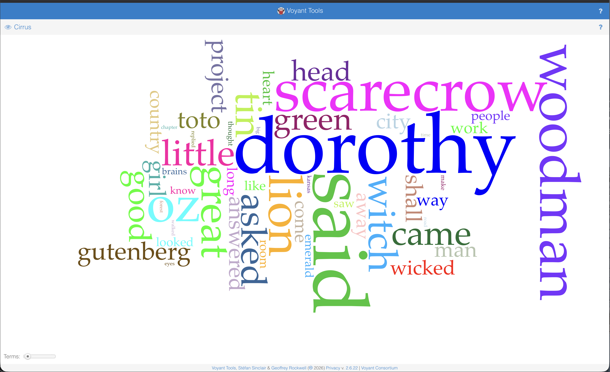

## Text Analysis Tool Comparison: Voyant vs. Generative AI

*I chose The Wizard of Oz as the text for this exercise, comparing Voyant and Copilot. I found a YouTube video with instructions for uploading a text to Voyant. It was called “Project Gutenberg,” and it held a collection of novels you could download as e-books in different formats. I immediately noticed how Voyant generates a word cloud that highlights the words that appear most in the text. It also has a section that shows the complete text you uploaded, and it includes a graph of the most commonly used words as well. While Voyant would be convenient for helping me identify keywords within a text, it makes it more difficult to actually analyze the text in any real detail. A major flaw that Copilot showed for Voyant is that since the file contains Project Gutenberg and licensing material, if Voyant analyzes the entire file, terms from the licensing may contaminate the data. Copilot is intuitive enough to understand that the licensing information is not part of the text and excludes that data.*

# A Distant Reading Assignment

